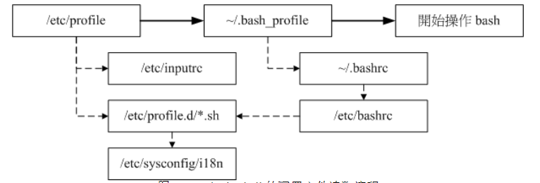

# Linux-Learning
Some problems and details when I studying Linux System.

## 一些常用命令
### 查看系统信息
* lscpu：查看的是cpu的统计信息.
* cat /proc/cpuinfo：可以知道每个cpu信息，如每个CPU的型号，主频等。
* free -m: 概要查看内存情况
* cat /proc/meminfo:  查看内存详细使用
* lsblk: 查看硬盘和分区分布
* fdisk -l: 看硬盘和分区的详细信息
* blkid：查看分区的UUID命令
* mkfs -t ext4 /dev/sdb：格式化硬盘
* mount (-t type) (-o option) /dev/sdb point：挂载硬盘到某个位置
### 有关进程的命令
* telnet ip port: 测试某个端口的连通性
* lsof -i:5037: 查看端口号占用
* ps -a: 打印进程
* kill <数字信号> <进程ID>：根据进程ID来杀死后台进程，一般使用的是15信号，但是有些进程可能不会理会该信号，所以可以加 -9 来使用9信号，该信号则不会被忽略。（kill -9 pid）
* pkill <数字信号> <进程名>：根据进程名杀死后台进程。（pkill -9 进程名）
### ssh 和 scp 
* ssh \<username>@serverIP :从一个终端使用ssh连接到另一个终端，需要输入该终端的用户密码。
#### scp从本地复制至远程
* scp \<local file path> \<username>@\<remote IP>:\<remote path>,传输单个文件或多个文件到指定目录下，其中local file path可以是单个文件或多个文件，多个文件用空格隔开。
* scp -v -r \<local folder path> root@\<remote IP>:\<remote path>， 传输整个文件夹到指定目录下。
#### scp从远程复制到本地
从远程复制到本地，只要将从本地复制到远程的命令的后2个参数调换顺序即可，如下：
* scp \<username>@\<remote IP>:\<remote path> \<local file path>
### git 使用
有关git的文档可以查阅 [github官方文档](https://docs.github.com/cn)。

    git远程服务器和本地用户机器之间使用SSH公钥进行验证。
    用户的SSH公私钥一般保存在 ~/.ssh/目录下，分别为id_rsa,id_rsa.pub。如果没有该文件，可以使用ssh-keygen来创建。
    在创建了ssh公私钥之后，可以查看id_rsa.pub，复制其中的公钥内容添加到git上。

## 一些Linux环境安装时的记录
### bashrc 和 profile 的区别
#### /etc/profile和/etc/bashrc
    每个用户登录bash时都会先读取/etc/profile的配置，里面的配置为所有用户系统环境，
    之后再读取/etc/bashrc配置（很多系统已经没有该配置文件）。之后继续读取外部的配置。
#### ~/.bash_profile 
    bash 在读完了整体环境配置的 /etc/profile 并藉此呼叫其他配置文件后，接下来则是会读取使用者的个人配置文件。 
    在 login shell 的 bash 环境中，所读取的个人偏好配置文件其实主要有三个，依序分别是：
    1. ~/bash_profile
    2. ~/bash_login
    3. ~/.profile
上述三个文件会按照顺序读取，并且只会读取其中一个。一个login shell读取流程如下：

 
#### 总结如下
    1、用户登入shell进程时，首先读入的是全局环境变量设定的/etc/profile，
    然后根据其内容读取额外的设定的文档，如/etc/profile.d和/etc/inputrc。
    2、然后根据不同用户去其家目录读取~/.bash_profile，如果这读取不了就读取~/.bash_login，
    这个也读取不了才会读取~/.profile，这三个文件设定基本上是一样的, 读取有优先关系.
    3、之后根据不同用户读取不同的~/.bashrc
### 安装虚拟机环境
    1. 安装图形化 apt install ubuntu-desktop
    2. 安装virtual-box https://www.virtualbox.org/wiki/Linux_Downloads
    3. 安装genymotion wget http://202.120.38.131/genymotion-linux_x64.bin
### adb错误
    List of devices attached
    adb server is out of date.  killing...
    cannot bind 'tcp:5037': Address already in use
    ADB server didn't ACK
    * failed to start daemon *

#### 解决方法： 

    lsof -i:5037找出5037端口
    kill -9 <pid>

## 虚拟机测试时写的一些脚本
### 绑定内核与进程
主要使用命令 taskset -cp <内核（0-N）> \<pid> 进行绑定。
示例脚本如下：

    #!/bin/bash
    num=0
    pid=$(ps -a|grep player|grep -v grep|awk '{print $1}')
    for i in $pid./
    do
        echo "bangding the $num cpu with player ${i}"
        taskset -cp $num $i
        num=`expr $num + 1`;
    done

### 使用genymotion虚拟机软件在服务器上进行测试时使用的一些shell脚本：
* create.sh：使用genymotion提供的命令创建虚拟机，可以选择数量和配置。
* delete.sh：删除已创建的虚拟机。
* start.sh：启动固定数目的虚拟机。
* installapp.sh：在已经启动的虚拟机上通过apk安装软件。
* startapp.sh：启动所有运行中虚拟机上的某个软件。
* uninstanllapp.sh：卸载所有运行中的虚拟机的某软件。
* modifyvm.sh：修改虚拟机的网络模式。
* getlog.sh：从所有运行中的虚拟机取得某个软件运行的log。